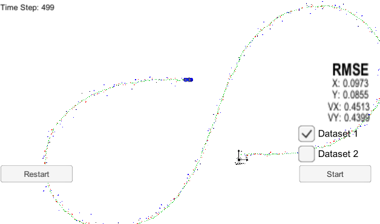
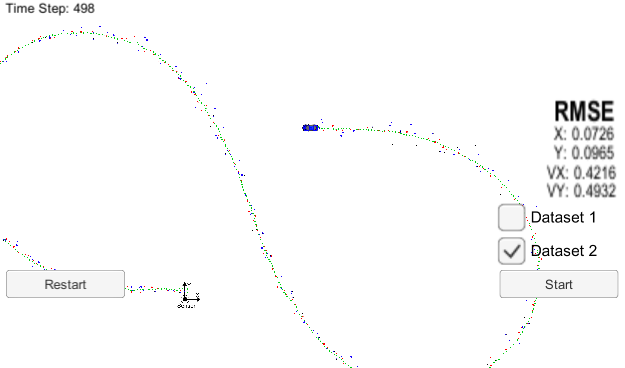

# Extended Kalman Filter Project 

In this project a kalman filter was utilized to estimate the state of a moving object of interest with noisy lidar and radar measurements. 

The project was created with the Udacity [Starter Code](https://github.com/udacity/CarND-Extended-Kalman-Filter-Project).
It involves the Term 2 Simulator which can be downloaded [here](https://github.com/udacity/self-driving-car-sim/releases).

## Content of this repo
- `scr` a directory with the project code.
  - `main.cpp` - reads in data, calls a function to run the Kalman filter, calls a function to calculate RMSE.
  - `FusionEKF.cpp` - initializes the filter, calls the predict function, calls the update function.
  - `kalman_filter.cpp`- defines the predict function, the update function for lidar, and the update function for radar.
  - `tools.cpp` - a function to calculate RMSE and the Jacobian matrix.
- `data`  a directory with two input files, provided by Udacity.
- [task.md](task.md) the task of the project by Udacity

## Results
Here are two screenshots showing the results after running the simulator for the two datasets.

Dataset 1

Dataset 2

## References
The code in this project was adapted from the lessons on Extended Kalman Filters, which are part of the Nanodegree program.
